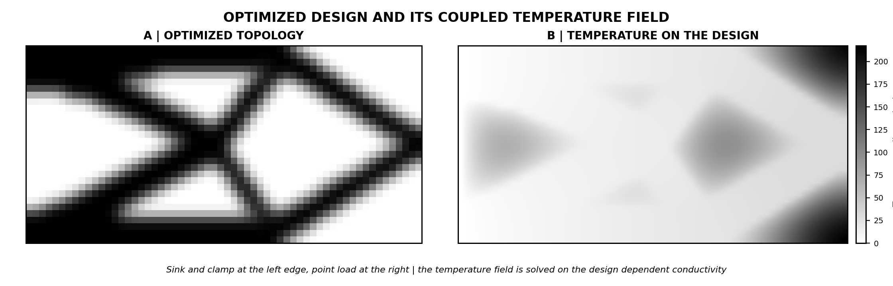
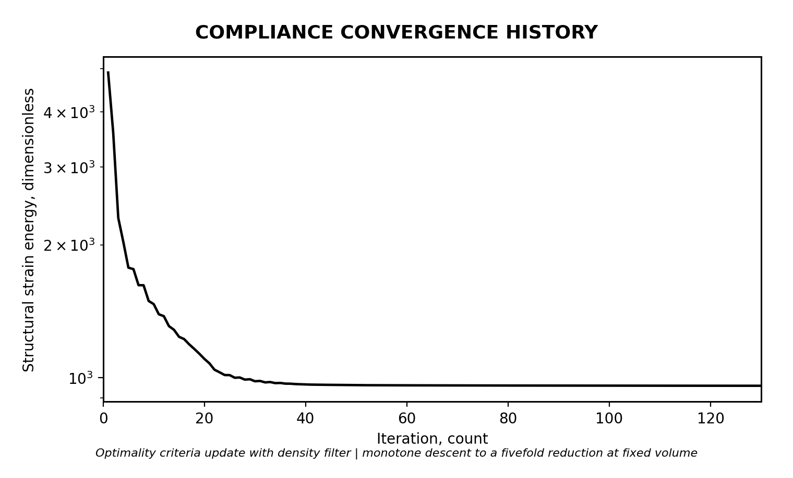
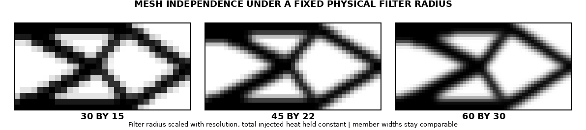

# Results, Sensitivity Verification, and Limitations

## Optimization Problem

The demonstrated case is a clamped cantilever that is heated at its support. The left edge is fixed in both displacement components and held as a heat sink at zero temperature. A point load acts downward at the mid height of the right edge. A uniform heat input is applied across the domain, and the temperature field is solved on a conductivity that interpolates with the design, so the field responds to the material layout at every iteration. The objective is the structural strain energy under the combined mechanical and thermal load, minimized at a fixed volume fraction of 0.45. The optimizer is optimality criteria with a density filter, a density floor of one part in a thousand, and penalization exponents of three on stiffness, conductivity, and the thermal stress coefficient.

## Optimized Result

The headline grid is 60 by 30. The optimizer reduces the strain energy by a factor near five over 130 iterations while holding the volume at the target, and the descent is monotone after the first few steps. The converged design is a diagonally braced cantilever that carries the tip load through two triangulated cells, with the boundary resolved cleanly and a gray fraction near 0.30. Panel B of the topology figure shows the temperature field on that converged design, which proves the thermal solve is genuinely coupled to the material distribution rather than imposed as a fixed field.

## Sensitivity Verification

The single most important check for any gradient based optimizer is that the analytical sensitivity matches a finite difference probe. The coupled adjoint here carries a thermal path, because the temperature field depends on the design, and it carries the density filter chain. A central difference at a step of one part in a million was compared against the adjoint gradient on eight randomly selected elements of a coarse grid. The maximum relative error was below six parts in one hundred million. A discrepancy that small certifies the entire sensitivity chain: the mechanical adjoint, the thermal adjoint, the interpolation derivatives, and the filter transpose.

## Mesh Independence

The density filter fixes a physical length scale, so refining the grid should not refine the members. Three resolutions, 30 by 15, 45 by 22, and 60 by 30, were solved with the filter radius scaled to a constant physical size and the total injected heat held constant. All three converge to the same diagonally braced topology with comparable member widths. The absence of finer features at finer resolution is the signature of a working length scale.

## Forward Validation Recap

The forward engine that this optimizer calls was validated independently against closed form solutions: steady state conduction to a maximum error near three parts in ten thousand billion, a thermal patch test returning zero stress under free expansion, a fully clamped plate returning the exact biaxial thermal stress of minus 180 megapascal, and a two way fixed point converging in three iterations. The optimizer therefore rests on a forward solver whose correctness is established term by term.

## Limitations

The demonstration is two dimensional, linear elastic, and steady state. The optimized result uses one way thermal to mechanical coupling, where the temperature field depends on the design but not on the deformation; the two way coupling that closes the loop through a deformation dependent conductivity is validated at the forward solve level and enters optimization through the same coupled adjoint, which is the immediate extension. The objective is structural strain energy, chosen for its monotone behavior; mean compliance under a thermal load is known to be non monotonic, and the engine supports it but the present study does not lead with it. Intermediate densities persist at a level typical of a pure density filter; a Heaviside projection would sharpen the boundary further and is a direct addition. Three dimensional problems will need an iterative solver with preconditioning in place of the direct factorization used here.

## Reproducibility

Every result above regenerates from the repository. The optimizer is `topoheat/topopt_thermoelastic.py`, the gradient check is its `gradient_check` function, the forward validation is `topoheat/thermoelastic_fem.py`, and the figures are `topoheat/results_figures.py`. All parameters, boundary conditions, and penalization exponents are set in the run scripts and recorded in this section. No result depends on a hidden seed beyond the fixed random draw used in the gradient probe, which is seeded explicitly.

## Figures

